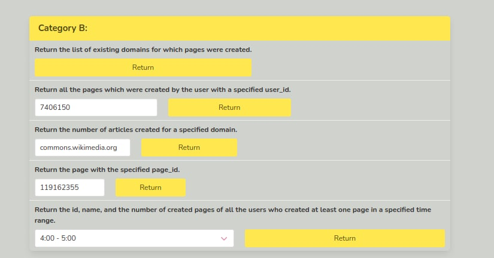

# Big Data project: WIKI stream
Project for Big Data course at Ukrainian Catholic University: processing and preparing data from wikipedia stream in order to provide two sets of APIs
to user.

## Project architecture


## Instructions:
```
docker-compose build && docker-compose up
```
*Warning: the docker image we use takes a lot of time to be downloaded (from 10 to 30 minutes).*

Connect to the website on [http://0.0.0.0:5000](http://0.0.0.0:5000). (here You will 
be able to send requests for both types of API sets).

Home interface:


Finish and clean up:
```
docker-compose down
```

## Results
Full results for each API call are saved as html files in [final results directory](final_results).
Here are the parameters, which were used for requests from category B:


For request A 3 we had to restart system (due to accidental TypeError when preparing data to be sent to Cassandra T_T),
so info for this request is available for a smaller time range than all the other info.
