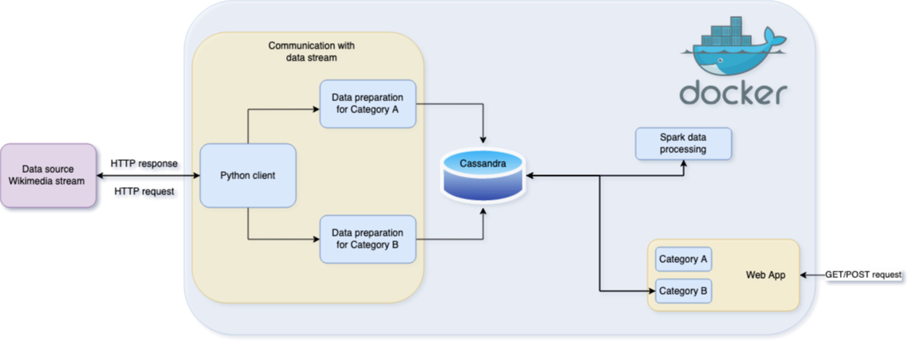
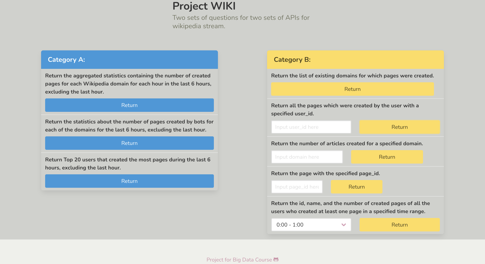

# Big Data project: WIKI stream
Project for Big Data course at Ukrainian Catholic University: processing and preparing data from wikipedia stream in order to provide two sets of APIs
to user.

## Project architecture


## Instructions:
```
docker-compose build && docker-compose up
```
*Warning: the docker image we use takes a lot of time to be downloaded (from 10 to 30 minutes).*

Connect to the website on [http://0.0.0.0:5000](http://0.0.0.0:5000). (here You will 
be able to send requests for both types of API sets).

Finish and clean up:
```
docker-compose down
```

## Examples
Examples (after ~8 hours processing and preparing wiki data):


Home interface:
